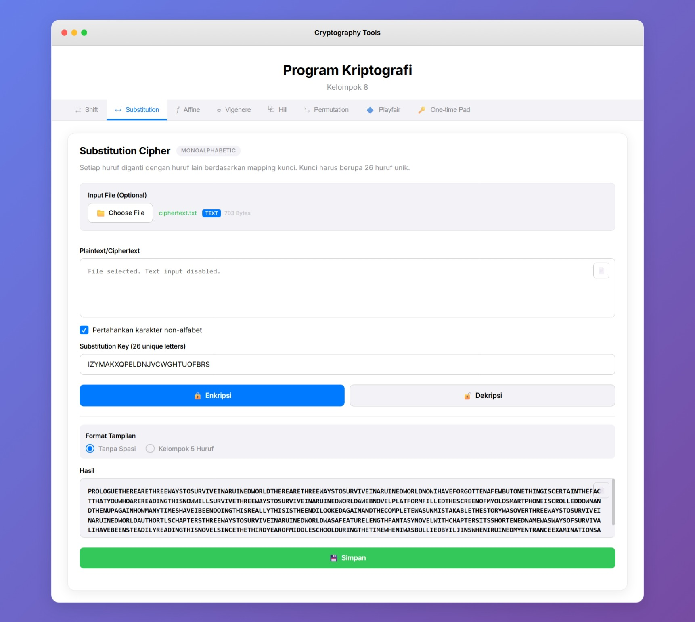

# Tugas 1 Kriptografi 2025
Repository ini digunakan untuk mengerjakan Tugas 1 Kriptografi Informatika UNS tahun 2025.  
Aplikasi berbasis website ini merupakan implementasi dari beberapa algoritma cipher yaitu:
1. Shift Cipher
2. Substitution Cipher
3. Affine Cipher
4. Vigenere Cipher
5. Hill Cipher
6. Permutation Cipher
7. Playfair Cipher
8. One-time Pad

## Preview Website
Tampilan aplikasi web:  
<p align="center">
  
</p>

# Anggota Kelompok 8

| Nama              | Foto Profil                                                                 | NIM        | Angkatan | Github Profile                                                                 |
|-------------------|------------------------------------------------------------------------------|------------|----------|--------------------------------------------------------------------------------|
| Danang Aprianto   |  | L0122043   | 2022     | <a href="https://github.com/Pr1nzx" target="_blank">Pr1nzx</a>                 |
| Ervand Aulia Nasution      |  | L0122056   | 2022     | <a href="https://github.com/ErvandAulia" target="_blank">ErvandAulia</a>       |
| Ikhsan Ari Novianto      |  | L0122077   | 2022     | <a href="https://github.com/ikhsannovianto" target="_blank">ikhsannovianto</a> |

# Fitur Utama
- 🔑 Mendukung berbagai algoritma cipher klasik (Shift, Substitution, Affine, Vigenere, Hill, Permutation, Playfair, One-time Pad).  
- 📝 Bisa memilih mode **Encrypt** dan **Decrypt**.  
- 📋 Tersedia tombol **Copy Result** untuk menyalin hasil dengan cepat.  
- 💾 Tersedia tombol **Save Result** untuk menyimpan hasil enkripsi/dekripsi.  
- 🔤 Mendukung opsi mempertahankan karakter non-alfabet (misalnya spasi, angka, simbol).  
- 🖼️ Pilihan output/hasil format tampilan:  
  - **Tanpa Spasi**  
  - **Kelompok 5 Huruf**  

# Cara Menjalankan
1. Clone repository
    ```bash
    git clone -b firsttask https://github.com/Pr1nzx/Kriptografi2025.git
    ```

2. Masuk ke direktori proyek
    ```bash
    cd Kriptografi2025
    ```

3. Buka `index.html` di browser

4. Pilih tab algoritma cipher yang diinginkan

5. Masukkan Plaintext/Ciphertext yang akan dienkripsi/didekripsi beserta key-nya

6. Simpan hasil enkripsi/dekripsi